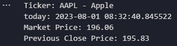

# yfinance 

## install

```
pip install yfinance
```

## introduce

### all dicts

- address1
- city
- state
- zip
- country
- phone
- website
- industry
- industryDisp
- sector
- longBusinessSummary
- fullTimeEmployees
- companyOfficers
- auditRisk
- boardRisk
- compensationRisk
- shareHolderRightsRisk
- overallRisk
- governaceEpochDate
- compensationAsOfEpochDate
- maxAge
- priceHint
- previousClose
- open
- dayLow
- dayHigh
- regularMarketPreviousClose
- regularMarketOpen
- regularMarketDayLow
- regularMarhetDayHigh
- payoutRatio
- beta
- trailingPE
- forwardPE
- volume
- regularMarketVolume
- averageVolume
- averageVolume10days
- averageDailyVolume10Day
- Bid
- ask
- bidSize
- askSize
- marketCap
- fiftyTwoWeekLow
- fiftyTwoWeekHigh
- priceToSalesTrailing12Months
- fiftyDayAverage
- twoHundredDayAverage
- trailingAnnualDividendRate
- trailingAnnualDividendYield
- currency
- enterpriseValue
- profitMargins
- floatShares
- sharesOutstanding
- sharesShort
- sharesShortPriorMonth
- sharesShortPreviousMonthDate
- dateShortInterest
- sharesPercentSharesOut
- heldPercentInsiders
- heldPercentInstitutions
- shortRatio
- shortPercentOfFloat
- impliedSharesOutstanding
- bookValue
- priceToBook
- lastFiscalYearEnd
- nextFiscalYearEnd
- mostRecentQuarter
- earningsQuarterlyGrowth
- netIncomeToCommon
- trailingEps
- forwardEps
- pegRatio
- lastSplitFactor
- lastSplitDate
- enterpriseToRevenue
- enterpriseToEbitda
- 52WeekChange
- SandP52WeekChange
- exchange
- quoteType
- symbol
- underlyingSymbol
- shortName
- longName
- firstTradeDateEpochUtc
- timeZoneFullName
- timeZoneShortName
- uuid
- messageBoardId
- gmtOffSetMilliseconds
- currentPrice
- targetHighPrice
- targetLowPrice
- targetMeanPrice
- targetMedianPrice
- recommendationMean
- recommendationKey
- numberOfAnalystOpinions
- totalCash
- totalCashPerShare
- ebitda
- totalDebt
- quickRatio
- currentRatio
- totalRevenue
- debtToEquity
- revenuePerShare
- returnOnAssets
- returnOnEquity
- grossProfits
- freeCashflow
- operatingCashflow
- earningsGrowth
- revenueGrowth
- grossMargins
- ebitdaMargins
- operatingMargins
- financialCurrency
- trailingPegRatio

### How to use

#### import library

```py
import yfinance as yf
```

#### command

> during this repo will use AAPL - apple stock as example

- print current market price

```py
import yfinance as yf
import datetime
ticker = yf.Ticker('AAPL').info
market_price = ticker['regularMarketOpen']
previous_close_price = ticker['regularMarketPreviousClose']
current_time = datetime.datetime.now()
print('Ticker: AAPL - Apple')
print('today:',current_time)
print('Market Price:', market_price)
print('Previous Close Price:', previous_close_price)
```



- Choose Ticker

```py
yf.Ticker('AAPL').info
```

some regular ticker:
- FB7926-USD: facebook
- GOOGL19433-USD: Google

currency:
- EURUSD=X: USD/EUR
- VND=X: USD/VND

#### Set a set of data

